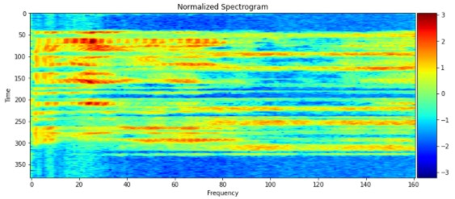
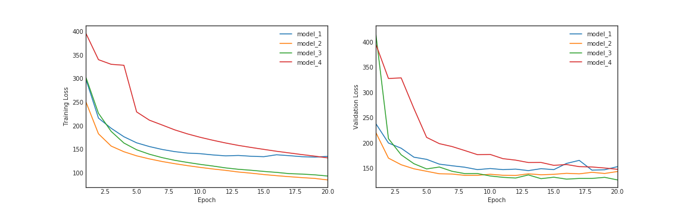
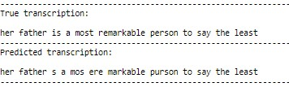

# Automatic-Speech-Recognizer
Build end-to-end Deep Neural Network to translate speech to text (ASR model)

# Description
This project is part of Udacity's Natural Language Processing Nanodegree.

The notebook showcases a deep neural network that functions as part of an end-to-end automatic speech recognition (ASR) pipeline. The pipeline accepts raw audio as input (.wav audio files) and returns a predicted transcription of the spoken language. The full pipeline is summarized in the figure below.

The pipeline follows this steps: 
- STEP 1 is a pre-processing step that converts raw audio to one of two feature representations that are commonly used for ASR: Spectrograms or MFCC (Mel Frequency Cepstral Coefficients). They both represents the frequencies of the audio signal over time. They represent extracted features from the audio signal which are easier to work with.

example of a spectrogram:

- STEP 2 is an acoustic model which accepts these extracted audio features as input and returns a probability distribution over all potential transcriptions. This step leverages Recurrent Neural Network capabilities to work over time series: We will process temporally distributed features extracted from an audio signal and convert into written output.

- STEP 3 in the pipeline takes the output from the acoustic model and returns a predicted transcription.

# Dataset

The project uses [LibriSpeech](http://www.danielpovey.com/files/2015_icassp_librispeech.pdf). This is a large corpus of English-read speech, designed for training and evaluating models for ASR. The dataset contains 1000 hours of speech derived from audiobooks. Each sample is labelled with the text in english. The dataset can be downloaded [here](http://www.openslr.org/12/).

The training of the models is done over a subset of the dataset:
- [dev-clean](http://www.openslr.org/resources/12/dev-clean.tar.gz) which comprises over 2000 audio samples
- [test-clean](http://www.openslr.org/resources/12/test-clean.tar.gz)

Download the datasets and convert all the files from FLAC to WAV. This can be done using the flac.exe, FLAC.dll and OGG.dll (coming when installing libav library, look into your downloaded packages in Anaconda folder) and the following script placed at the root of the folders containing the .flac files.

`@ECHO OFF
FOR /R %1 %%G IN (*.flac) DO (
    ECHO "Attempting to convert %%G"
    flac.exe -d "%%G"
)`

# Dependencies

The project requires tensorflow (I use 2.1.0) and keras (2.3.1). In addition these librairies are required:
- librosa
- soundfile
- python_speech_features

The training requires significant GPU computation power.

# Approach

The project tests various neural network architectures for the Acoustic Model and compares their relative performance. The task of the Acoustic Model is complex and heavy as it learns the mapping from the extracted features of the audio files to probability distribution over graphemes (smallest unit which can be written in a language). For English, there are 28 graphemes (26 alphabetic letters + `space` + `<PAD>` token). This tasks is performed over a large number of time steps (speech).

This task also requires sequencing of the voice signal so that to map sounds units to the graphemes. No sequencing information is provided to the network and this has to be learned during training ! To manage this, the model uses a specific loss function widely used for speech-to-text problems and well adapted to sequencing: Connectionist Temporal Classification or CTC. The input to this loss function is frame vectors representing regular time intervals  and must guide the output of sequence of phonemes, graphemes or words during training and gradient descent.

The objective of the CTC loss function is to have the softmax output of the RNN to spike for each grapheme, phoneme or word and minimize output to nothing between these. This would allow to sequence audio signals of arbitrary length. For more information on the CTC loss, you can refer to this seminal [paper](http://machinelearning.wustl.edu/mlpapers/paper_files/icml2006_GravesFGS06.pdf).

The approach and decoder function is also constrained by the way the training data are labelled, ie with plain text (transcript of the audio content). Therefore we must match the audio signal to characters (the graphemes) which are the available labels. In the project, the model will predict character by character, along the timesteps. The approach is not word / phoneme based unless we add a language model.

# Tested models

A panel of various RNNs are tested.
- model_0: Simple GRU with softmax output. This is a very simple model using a GRU layer because recurrent neural network (RNN) are effective in modeling sequential data. The softmax output of the RNN at each time step is a vector of probabilities with 29 entries, where the  𝑖 -th entry encodes the probability that the  𝑖 -th character is spoken in the time sequence.

- model_1: GRU cell with a Dense layer to output the probability of the grapheme (character). A BatchNormalization is normalizing the output of the GRU section. This requires a TimeDistributed wrapper around the Dense layer to output the predicted sequence. The TimeDistributed layer will be used to find more complex patterns in the dataset. The output of the GRU RNN is assimilated as a hidden layer. The TimeDistributed is used to apply a Dense layer to each of the time steps in the RNN output. The Dense will be repeated as many as timesteps to ensure the output will constitutes a volume of probability distribution for each time step.

- model_2: A sequence of 1-dimension Convolution layer + RNN with BatchNorm + TimeDistributed Dense layer with Softmax output. The idea is that the features input (spectrograms) can also be viewed as vectors along timesteps. Therefore their analysis can be handled by a 1-dimension Convolution layer, like Conv2D are the go-to solutions to process images. We can expect the layer to convolve these vectors over the temporal dimension, producing new vectors of dimensions (new timesteps x filters). One can draw a parallel with Conv2D over images which extracts spatial features over two dimensions. The 1D Conv passes these features organized over a new sequence (new time step) to a simple rnn layer with much less paramaters vs a GRU layer. 

- model_3: A Deeper RNN (2 GRU cells) with BatchNorm and TimeDistributed Dense layer with Softmax output. It is composed of 2 GRU layers with BatchNormalization (followed by the standard Dense (TimeDistributed) with Softmax). 200 units are used.

- model_4: A Bidirectional GRU layer followed by TimeDistributed Dense layer with Softmax output. No BatchNorm is used here.

# Result of the exploration phase

Over these 5 architectures (model_0 to model_4) covered during the exploration phase, Model_3 achieves the best performance. Performance is superior to a Bidirectional GRU with 200 units (Model_4). Model_2 is not as good as Model_3 but is much faster to train. It uses a 1D convolutional layer just after the Input layer. This Conv layer basically considers the spectrograms as temporal vectors along timesteps and convolve these vectors over the temporal dimension, producing new vectors with new dimensions (new timesteps x filters). One can draw a parallel with Conv2D over images which extracts spatial features over two dimensions. It passes these features along a new sequence to a simple rnn layer with much less paramaters vs a GRU layer. This appears effective in computation time for a limited increase in val_loss. This is something I try to leverage to improve the architecture for the final model.

Based on these observations, I tested several other models of which these three:

- Model 6 builds upon Model_4 adding complexity using 2 x Bidirectional GRU layers and no BatchNormalization. This does not improves the val_loss beyond Model_3 and significantly increase the computation time and requirements (1.2Mio param vs less than 0.5Mio for model_3).

- Model_7 : I combine Model_3 and Model_6 by using 2 x Bidirectional GRU layers and BatchNormalization. Model_7 outperforms Model_3 reducing the val_loss further. But this has a cost with the increase in parameters (doubling the output features from concatenation) to 1.1Mio vs less than 0.5Mio for model_3.

- Model_5 actually combines Model_2 and Model_3 and builds on their benefits: 
    - Model_5 uses a 1D convolutional layer like Model_2 which proved very efficient to extract temporal features from spectrograms.
    - Model_5 uses the deep network design of Model_3 with 2 x SimpleRNN layers stacked with batchNormalization. I substitute the more complex GRU of Model_3 by the SimpleRNN used in Model_2 (very fast).
    - All in all, Model_5 is a deep RNN using a convolutional layer at the front and with only 0.5Mio parameters. The training time is fast and the model achieves a similar performance as Model_7.

The relative performances are presented below (training loss left and validation loss right).

Why is Model_5 performing the best ?
- It uses a Convolutional layer very efficient to extract temporal features and well suited to process spectrograms. Like Conv2D which extract the important information from an image, "summarizing" it, one could image that the 1D conv layer assemble temporal vectors capturing the key information and summarizing the audio features over a new number of timesteps according to its content. As such it rearrange the temporal distribution and learn to align this so that the translation to text is improved during preduction.
- It uses a deep rnn with 2 layers able to capture more complex patterns
- Because we are NOT using a language model to translate to text, the complexity of the RNN layer could be secondary. LSTM and GRU key strengths are their ability to capture long-term dependencies.

# Final results and conclusion

I decided to build upon the best model identified in the exploration phase, ie Model_5. The final model therefore uses:
- A 1D Convolutional layer after the input layer to extract temporal features from spectrograms considered as a sequence of vectors of dimension 161. This proved effective in the tested architectures above and able to "summarize" and extract the key information
- 2 x SimpleRNN layers instead of GRU or LSTM. LSTM lead to exploding gradient very easily. Compared to GRU, the SimpleRNN proved to run much faster with limited reduction in performance. I limited the depth to 2 layers. This reduces the vanishing gradient issue with deeper architectures (the deeper the architecture, the more challenging becomes backpropagation). I tried a 3-layer deep network but it did not manage to converge (both losses oscillated just over 200).
- BatchNormalization applied to each layer output including input layer. This helps the model to find the optimal solution quicker. This proved efficient on Model_3 and Model_5 vs the other architectures.

Other characteristics:
- In order to minimize overfitting risk from this architecture, I applied 10% drop out on each rnn layer.
- I increased the number of units of the RNN network to 512. This improves the convergence of the model compared to Model_5 (units = 200) and helps minimizing overfitting.
- TimeDistributed wrapper over the Dense layer so that to process each time step.

Transcription achieved from an audit segment:

