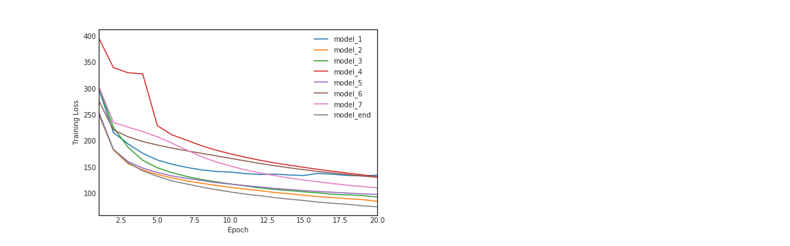
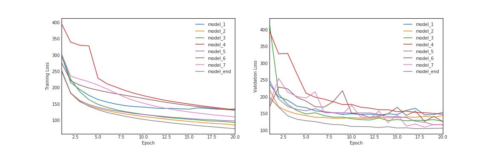

# Automatic-Speech-Recognizer
Build end-to-end Deep Neural Network to translate speech to text (ASR model)

# Description
This project is part of Udacity's Natural Language Processing Nanodegree.

The notebook showcases a deep neural network that functions as part of an end-to-end automatic speech recognition (ASR) pipeline. The pipeline accepts raw audio as input (.wav audio files) and returns a predicted transcription of the spoken language. The full pipeline is summarized in the figure below.

The pipeline follows this steps: 
- STEP 1 is a pre-processing step that converts raw audio to one of two feature representations that are commonly used for ASR: Spectrograms or MFCC (Mel Frequency Cepstral Coefficients). They both represents the frequencies of the audio signal over time. They represent extracted features from the audio signal which is easier to work with.

example of a spectrogram:

- STEP 2 is an acoustic model which accepts these extracted audio features as input and returns a probability distribution over all potential transcriptions. This step leverages Recurrent Neural Network capabilities to work over time series as we will process features extrated from an audio signal in order to translate into written output.

- STEP 3 in the pipeline takes the output from the acoustic model and returns a predicted transcription.

# Dataset
The project uses [LibriSpeech](http://www.danielpovey.com/files/2015_icassp_librispeech.pdf). This is a large corpus of English-read speech, designed for training and evaluating models for ASR. The dataset contains 1000 hours of speech derived from audiobooks. Each sample is labelled with the text in english. The dataset can be downloaded [here](http://www.openslr.org/12/).

The training of the models is done over a subset of the dataset:
- [dev-clean](http://www.openslr.org/resources/12/dev-clean.tar.gz) which comprises over 2000 audio samples
- [test-clean](http://www.openslr.org/resources/12/test-clean.tar.gz)

Download the datasets and convert all the files from FLAC to WAV. This can be done using the flac.exe, FLAC.dll and OGG.dll (coming when installing libav library, look into your downloaded packages in Anaconda folder) and the following script placed at the root of the folders containing the .flac files.

`@ECHO OFF
FOR /R %1 %%G IN (*.flac) DO (
    ECHO "Attempting to convert %%G"
    flac.exe -d "%%G"
)`

# Dependencies

The project requires tensorflow (I use 2.1.0) and keras (2.3.1). In addition these librairies are required:
- librosa
- soundfile
- python_speech_features

The training requires significant GPU computation power.

# Approach

The project tests various deep neural network architectures for the Acoustic Model and compares their relative performance. The task of the Acoustic Model is complex and heavy as it learns the mapping from the extracted features of the audio files to probability distribution over graphemes (smallest unit which can be written in a language). For English, there are 28 graphemes (26 alphabetic letters + `space` + `<PAD>` token). This taks is prodessing over a large number of time steps from speech.

This task aslo requires sequencing of the voice signal so that to map sounds units to the graphemes. No sequencing information is provided to the network and this has to be learned during training ! To manage this, the model uses a specific loss function widely used for speech-to-text problems and well adapted to sequencing: Connectionist Temporal Classification or CTC. The input to this loss function is frame vectors representing regular time intervals  and must guide the output of sequence of phonemes, graphemes or words during training and gradient descent.

The objective of the CTC loss function is to basically have the softmax output of the RNN to spike for each grapheme, phoneme or word and minimize output to nothing between these. This would allow to sequence audio signals of arbitrary length. For more information on the CTC loss, you can refer to this seminal [paper](http://machinelearning.wustl.edu/mlpapers/paper_files/icml2006_GravesFGS06.pdf).

# Tested models

A panel of various RNNs are tested.
- Simple GRU with softmax output. This is a very simple model using a GRU cell because recurrent neural network (RNN) are very effective in modeling sequential data. The softmax output of the RNN at each time step is a vector of probabilities with 29 entries, where the  𝑖 -th entry encodes the probability that the  𝑖 -th character is spoken in the time sequence.

- GRU cell with a Dense layer to output the probability of the grapheme (character). A BatchNormalization is normalizing the output of the GRU section. This requires a TimeDistributed wrapper around the Dense layer to output the predicted sequence. The TimeDistributed layer will be used to find more complex patterns in the dataset. The output of the GRU RNN is assimilated as a hidden layer. The TimeDistributed is used to apply a Dense layer to each of the time steps in the RNN output. The Dense will be repeated as many as timesteps to ensure the output will constitutes a volume of probability distribution for each time step.

- A sequence of 1-dimension CNN layer + RNN with BatchNorm + TimeDistributed Dense layer with Softmax output. The idea is that the features input (spectrograms) can also be viewed as images. Therefore their analysis will be handled by a 1-dimension Convolution layer which are the go-to solution to process images.

- A Deeper RNN (2 GRU cells) with BatchNorm and TimeDistributed Dense layer with Softmax output.

- A Bidirectional GRU layer followed by TimeDistributed Dense layer with Softmax output. No BatchNorm is used here.

- xxxxxxxxxxxxxxxxxx

The relative performances are presented below.

                            

# Results
